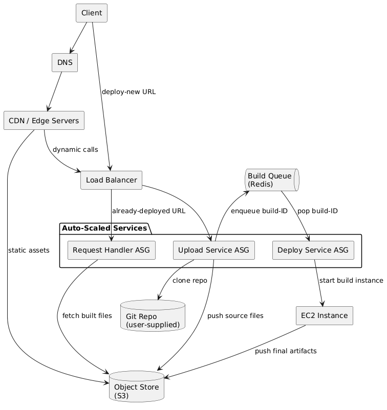

# System Design

## Why the backend is sliced into three workers

| Worker              | What it does                                                                                      | Why split it out?                                                                                                                               |
| ------------------- | ------------------------------------------------------------------------------------------------- | ----------------------------------------------------------------------------------------------------------------------------------------------- |
| **Request Handler** | Serves every normal API call and static proxy.                                                    | Keeps latency low. It is stateless, tiny, and can scale out in seconds when traffic spikes.                                                     |
| **Upload Service**  | Clones the user’s Git repo, zips it, drops the zip in S3, then pushes a *build‑ID* onto Redis.    | Git operations and big uploads no longer block the hot path. We can give these nodes extra disk and network without over‑provisioning the rest. |
| **Deploy Service**  | Watches Redis for new IDs, spins up a throw‑away EC2 build box, and later rolls the artefact out. | Deploy work is bursty and time‑consuming. Isolating it lets us throttle or pause roll‑outs with zero impact on live traffic.                    |

Because each layer is stateless, we can scale any of them down to zero when idle and save money.

---

## What each piece does

| Piece                   | Role                                                                                   |
| ----------------------- | -------------------------------------------------------------------------------------- |
| **DNS**                 | Turns `example.com` into the CDN’s IP.                                                 |
| **CDN / Edge**          | Serves cached JS/CSS/images; forwards only dynamic traffic.                            |
| **Load Balancer**       | Single public door; fans requests to the right Auto‑Scaled group.                      |
| **Build Queue (Redis)** | Glue between Upload and Deploy; flattens bursts of new builds.                         |
| **EC2 Build Worker**    | Pulls source from S3, runs the build, pushes the artefact back to S3, then shuts down. |
| **Object Store (S3)**   | Holds both raw source zips and final build artefacts.                                  |
| **Git Repo**            | Whatever repo URL the user gives; touched **only** by the Upload Service.              |

---

## End‑to‑end flow

1. **User hits “Deploy”.** The request reaches the **Upload Service**.
2. Upload clones the repo, zips the source, saves it to **S3**, and pushes a *build‑ID* to **Redis**.
3. **Deploy Service** pops that ID, launches an **EC2 Build Worker**, and passes the ID along.
4. The worker pulls the source zip from **S3**, builds, tests, bundles, and pushes the finished artefact back to **S3**.
5. Deploy Service swaps the new artefact into production.
6. Normal users keep hitting the **Request Handler**, which simply fetches the latest built files from **S3**.

A clean split of concerns means smoother scaling, easier debugging, and no single heavy task can clog the user‑facing path.

# To Do

* [x] Implement automatic dark mode
* [ ] Add logging to the frontend
* [ ] Containerize the builds
* [ ] Implement caching
* [ ] Parallel downloads/uploads
